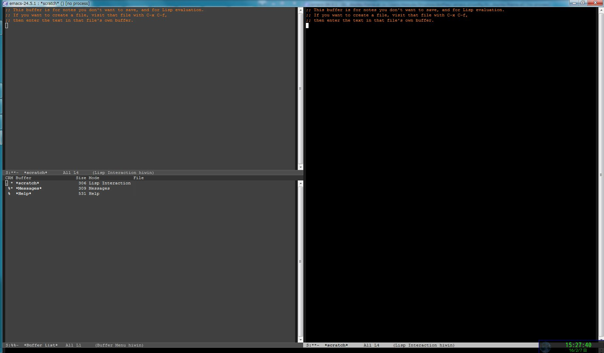

# hiwin-mode

## Introduction

`hiwin.el` is a minor-mode of Emacs to change the background color of
the deactive window.

## Screenshot



## Requirements

- Emacs 27 or higher

## Installation & sample setting

With `use-package.el` and [vc-use-package.el](https://github.com/slotThe/vc-use-package)
```emacs-lisp
(use-package hiwin-mode
  :vc
  (:fetcher github :repo fenril058/hiwin-mode)
  :config
  (hiwin-mode 1))
```

With [leaf.el](https://github.com/conao3/leaf.el):
```emacs-lisp
(leaf hiwin-mode
  :vc
  (:url "https://github.com/fenril058/hiwin-mode" :branch "main")
  :custom-face
  (hiwin-face . '((((class color) (background light))
                   (:background "gray90"))))
  :global-minor-mode t)
```


## Basic Usage

Enable hiwin-mode.
```emacs-lisp
(hiwin-mode 1)
```

## Customization

#### hiwin-face

Face for deactive windows. For example;
```
(set-face-background 'hiwin-face "gray80")
```

#### hiwin-ignore-buffer-names

List of the buffer names which do not change background color when
they are in a deactive window.

You can custmize this variable BEFORE enabling `hiwin-mode`. If you
change it while enabling `hiwin-mode`, you have to run
`hiwin-refresh-ignore-buffer-names` to
refresh`hiwin-ignore-buffer-name-regexp`.

#### hiwin-ignore-minibuffer-selected-window

If the value is `non-nil`, the background color of the window selected
just before the minibuffer does not change. The default value is `nil`.

## Similar packages

- [auto-dim-other-buffers.el](https://github.com/mina86/auto-dim-other-buffers.el)
